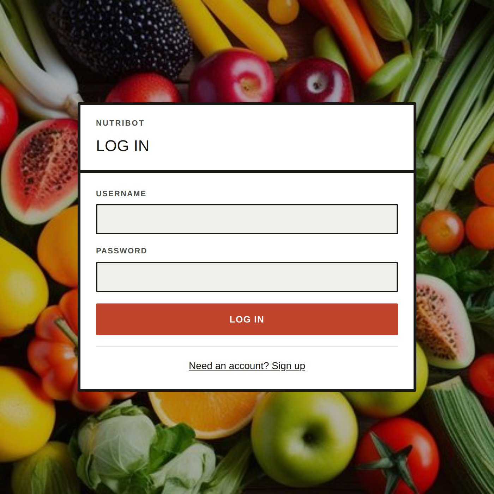
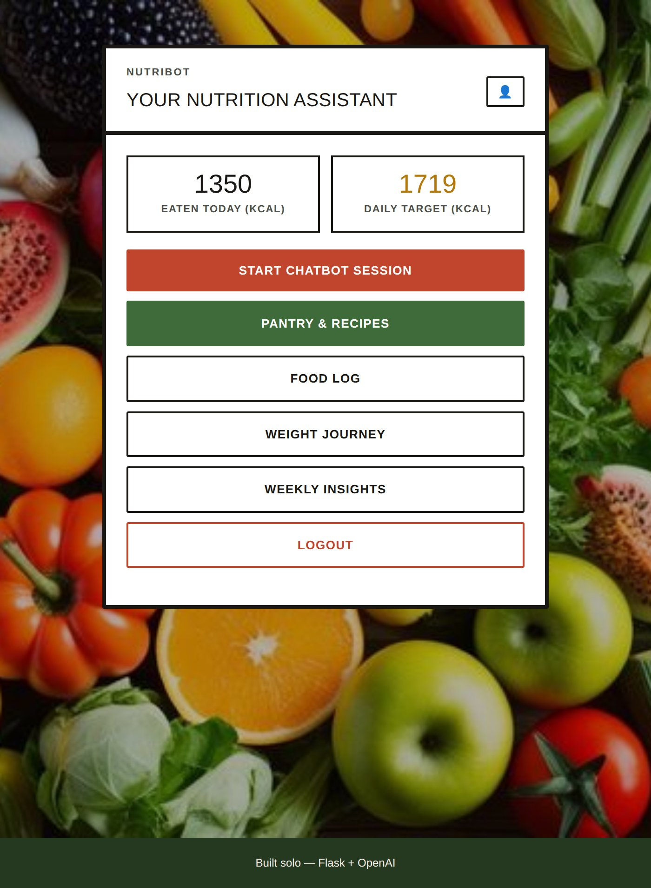
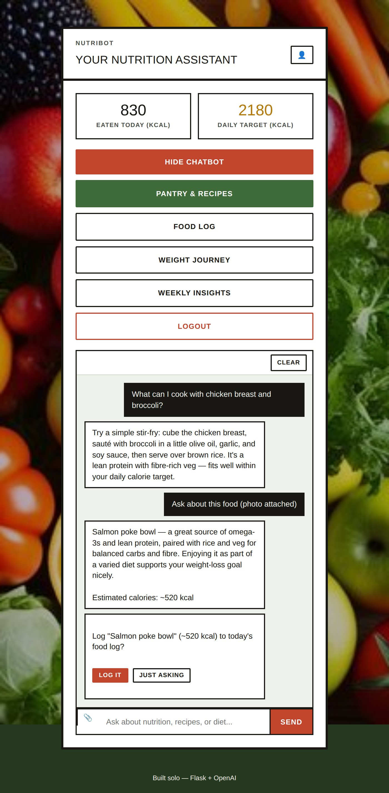
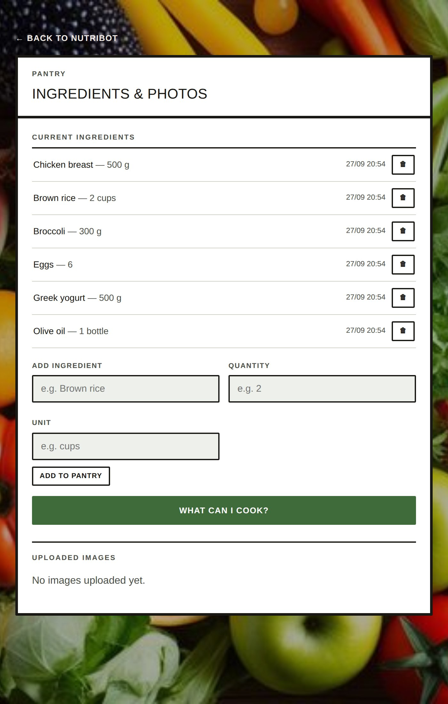
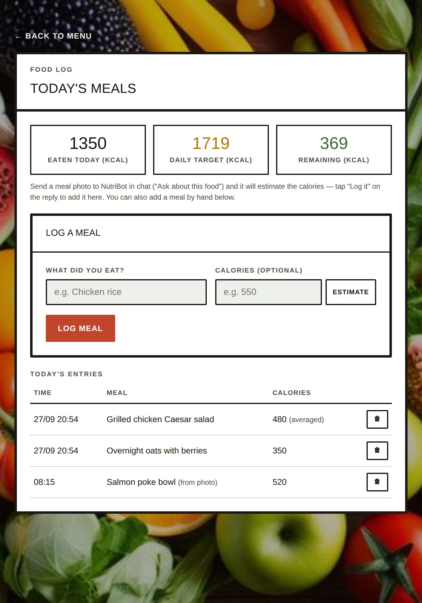
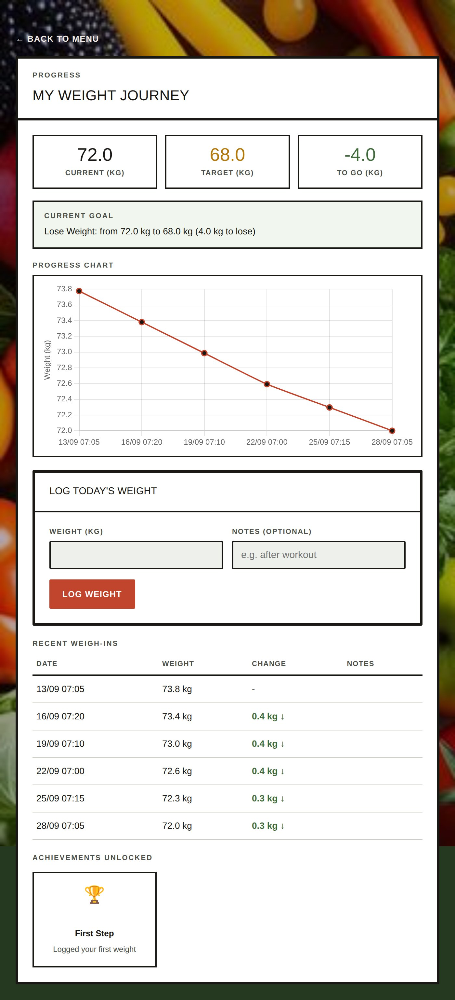
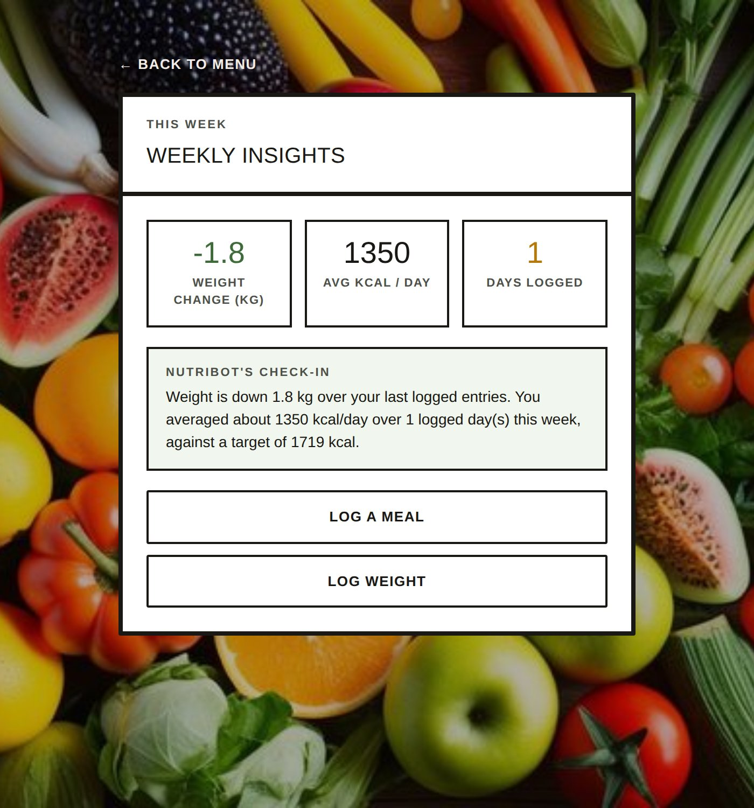
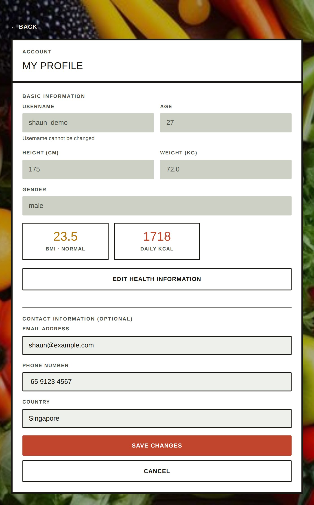

# NutriBot

**[Live Demo →](https://nutribot-7l26.onrender.com/)**

A nutrition assistant chatbot built with Flask and OpenAI — started as a hackathon project, now a solo build. Track meals and calories, manage a pantry, get recipe ideas from what's already on hand, log your weight, and get a weekly check-in, all backed by a GPT-powered chat assistant.

## Features

- **Chat assistant** — ask nutrition and diet questions, get personalized answers based on your profile
- **Meal photo analysis** — snap a photo of a meal and NutriBot estimates the dish and its calories; you choose whether to log it or were just asking
- **Pantry tracking** — add ingredients by hand (with quantity/unit) or by uploading a photo of your groceries
- **Recipe suggestions** — "What Can I Cook?" generates recipe ideas from your current pantry
- **Food log** — log meals manually (with an optional GPT calorie estimate) or from chat, see today's total against your daily target
- **Weight journey** — log weight over time, see a trend chart, goal progress, and achievement milestones
- **Weekly insights** — a rolling weight-change and average-calories summary with a GPT-phrased check-in

## Setup

```bash
git clone <this repo>
cd nutribot
python3 -m venv venv
source venv/bin/activate
pip install -r requirements.txt
```

Create a `.env` file in the project root:

```
OPENAI_API_KEY=your-openai-api-key
FLASK_SECRET_KEY=any-random-string
```

Then run it:

```bash
python3 server.py
```

The app runs at `http://127.0.0.1:5000`.

## Screenshots

### Log in

New here? Sign up; returning users log in with their username and password.



### Dashboard

Today's calories against your daily target, plus quick links to every part of the app.



### Chat assistant

Ask nutrition questions, or attach a photo to ask about a specific meal — NutriBot estimates the dish and calories, then asks whether to log it (so it never assumes you're eating just because you're curious).



### Pantry & recipes

Track ingredients on hand (manually or via photo upload), and generate recipe ideas from what's already in the pantry.



### Food log

Log meals by hand — with an optional GPT calorie estimate (flagged as "averaged" so it's never confused with a measured value) — or from a confirmed chat photo. See today's total, target, and how much you have left.



### Weight journey

Log weight over time, see a trend chart and progress toward your goal weight, and unlock milestones as you go.



### Weekly insights

A rolling summary of your weight change and average daily calories, with a short GPT-phrased check-in.



### Profile

Basic info, BMI, and daily calorie target, plus optional contact details.



## Tech stack

Flask (Python) backend, vanilla JS frontend, OpenAI (`gpt-4o-mini`) for chat, meal photo analysis, recipe suggestions, and weekly check-ins. Data is stored in a local JSON file (`db_groceries.json`) — no external database required.
